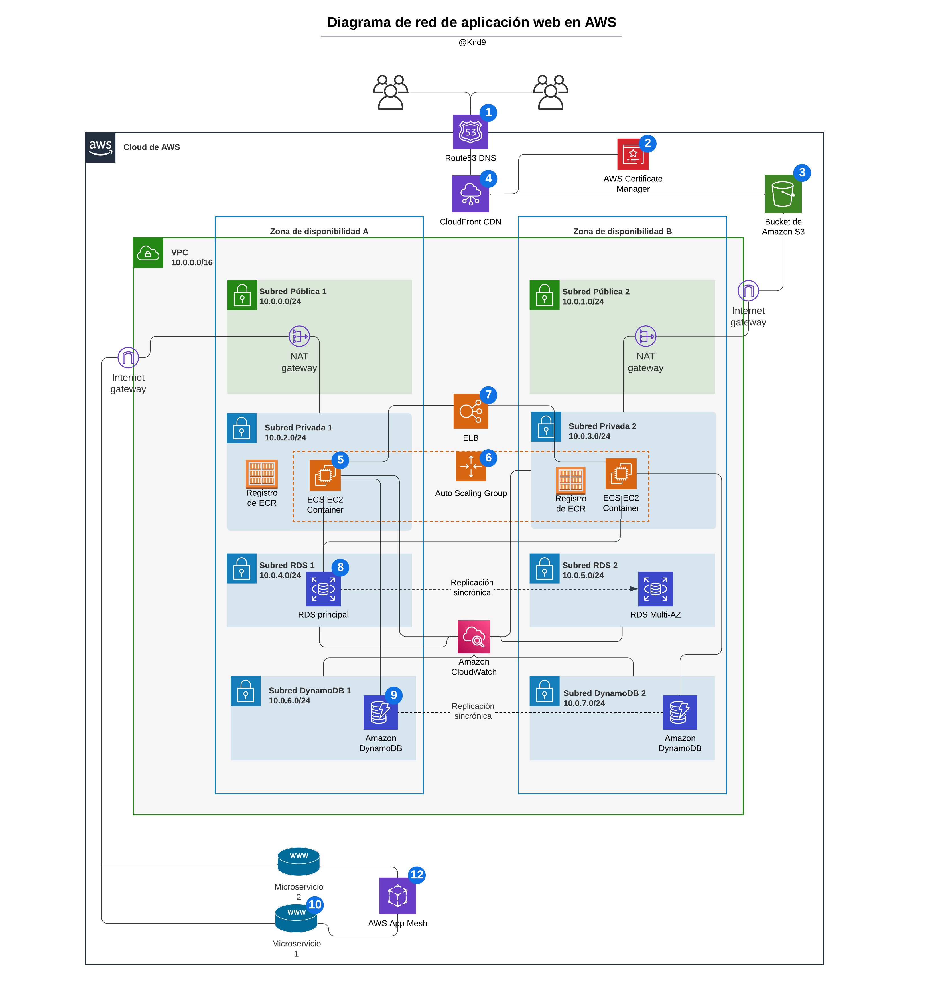

# DevOps Challenge

Requisitos y deseables:

La solución debe mostrarnos que usted puede:

* Automatizar la parte del proceso de despliegue. 
* Usar conceptos de CI para aprovisionar el software necesario para que los entregables se ejecuten. 

Use cualquier herramienta de CI de su elección para implementar el entregable.

## 1. Diagrama de Red:

Produzca un diagrama de red (puede utilizar lucidchart) de una aplicación web en GCP o AWS y escriba una descripción de texto de 1/2 a 1 página de sus elecciones y arquitectura. El diseño debe soportar:

- Cargas variables
- Contar con HA (alta disponibilidad)
- Frontend en Js
- Backend con una base de datos relacional y una no relacional
- La aplicación backend consume 2 microservicios externos

El diagrama debe hacer un mejor uso de las soluciones distribuidas.

*Solución*



Descripción del diseño:

Para satisfacer los requisitos mencionados, se proporciona una arquitectura de infraestructura para una aplicación web en la nube utilizando AWS, diseñada en [Lucidchart](https://www.lucidchart.com/pages/es).
Con el objetivo de garantizar una alta disponibilidad, se implementará una solución distribuida, con la replicación de servidores en diferentes zonas de disponibilidad. 

* Para la administración de DNS, se utilizará el servicio **Amazon Route 53** (1).
Puede utilizarse el servicio **AWS Certificate Manager** (2) para asegurar el tráfico **HTTPS** en el frontend. Este servicio permite provisionar, administrar y desplegar certificados SSL/TLS (Secure Sockets Layer/Transport Layer Security).

* El **Frontend** en Js se alojará en un bucket de almacenamiento a través del servicio **Amazon S3** (3). Este es un servicio de almacenamiento de objetos en la nube que además permite recuperar cualquier cantidad de datos desde cualquier lugar en la web, a través de su URL público.
Podría complementarse con **Amazon CloudFront** (4) como servicio de CDN (Red de Distribución de Contenidos) para mejorar la velocidad de carga de los archivos a través de su red de servidores global.

* El **Backend** se implementará en contenedores de **Docker**. Siguiendo el diseño mediante AWS, estos contenedores se pueden alojar, desplegar y ejecutar utilizando el servicio **Amazon Elastic Container Service (ECS)** en instancias **EC2** (*) (5), permitiendo una fácil integración con otros servicios de AWS. La administración de clústeres y escalado se realiza a través de **AWS Management Console**, **AWS CLI** o **SDK**. ECS ofrece dos modos de ejecución de contenedores: **Fargate**, que permite ejecutar contenedores sin preocuparse por la infraestructura subyacente, y **EC2**, que permite administrar las instancias EC2. Se usará **AWS Elastic Load Balancing (ELB)** (7) como balanceador de carga para distribuir la carga de tráfico entre las instancias EC2 del Backend.

  - Otra alternativa que ya contempla tanto el despliegue como también la administración de los contenedores de Docker a gran escala, es **Kubernetes de GCP**, que además se ejecuta en cualquier entorno de nube o local.

* Para la base de datos relacional, se puede utilizar el servicio **Amazon RDS** (8) o bien **Cloud SQL de GCP**.
* La base de datos no relacional se puede alojar en el servicio **Amazon DynamoDB** (9) o bien en **Firestore de GCP**.

* Los **microservicios externos** (10) se pueden integrar mediante el servicio **Amazon API Gateway** (11) para exponerlos como APIs y el backend los consuma. Este servicio de AWS permite crear, publicar y administrar APIs. Como complemento puede utilizarse el servicio **AWS App Mesh** (12), que permitirá controlar y supervisar el tráfico de red entre los microservicios que consume el backend. 

(*) El servicio **Amazon Elastic Compute Cloud (EC2)** permite lanzar instancias de servidores virtuales en la nube con varias opciones de configuración, como el tamaño de la instancia, el tipo de sistema operativo, la capacidad de almacenamiento y la cantidad de CPU y RAM. Se pueden utilizar múltiples instancias de EC2, distribuyendo el tráfico entre ellas. Incluso para soportar cargas variables, la función **Auto Scaling de EC2** (6) permite escalar automáticamente el número de instancias en función de la demanda, donde se pueden crear condiciones para agregar o eliminar instancias de EC2, logrando mantener la capacidad de la red para manejar picos de tráfico.

Otro servicio que sería muy útil agregar para el monitoreo de recursos utilizados es **Amazon Clou Watch**.

## 2. Despliegue de una aplicación Django y React.js:

Elaborar el deployment dockerizado de una aplicación en django (backend) con frontend en React.js contenida en el repositorio. Es necesario desplegar todos los servicios en un solo docker-compose. 

Se deben entregar los Dockerfiles pertinentes para elaborar el despliegue y justificar la forma en la que elabora el deployment (supervisor, scripts, docker-compose, kubernetes, etc)

Subir todo lo elaborado a un repositorio (github, gitlab, bitbucket, etc). En el repositorio se debe incluir el código de la aplicación y un archivo README.md con instrucciones detalladas para compilar y desplegar la aplicación, tanto en una PC local como en la nube (AWS o GCP).

*Solución*

La elección de la forma en que se elabora un deployment depende de factores como la complejidad de la aplicación y los recursos disponibles, entre otros.

* Supervisor es más adecuado para aplicaciones sencillas o pequeñas que se ejecutan en una sola máquina y no requieren una gran escalabilidad. 
* Los scripts de despliegue son una opción común para aplicaciones pequeñas o medianas. Además suelen ser específicos para cada aplicación y se ejecutan en el servidor de destino.
* Docker Compose permite definir y ejecutar aplicaciones multi-contenedor de manera fácil y reproducible. Es útil en particular para aplicaciones complejas que requieren varios servicios y que necesitan ser escalables. Docker Compose se utiliza para definir los servicios y las dependencias entre ellos, y para iniciar y detener los contenedores.
* Kubernetes es una plataforma de orquestación de contenedores que permite gestionar, desplegar y escalar aplicaciones en contenedores, dentro de la nube o PC local. Se adecúa a aplicaciones distribuidas y de alta escalabilidad, que requieren una gestión avanzada de contenedores, balanceo de carga, recuperación automática en caso de fallos,  entre otras características avanzadas.

La aplicación web que nos compete, si bien es pequeña o mediana, es más compleja debido a que tiene varios servicios y podría a futuro necesitar escalarse, por lo cual utilizo principalmente Docker Compose para elaborar el despliegue. 

Los archivos de Docker Compose creados describen los servicios necesarios y cómo se comunican entre sí. Es recomendable utilizar diferentes contenedores para el backend, el frontend, y la base de datos utilizada, debido a los distintos recursos que utilizan, la seguridad con su aislamiento, y su configuración. Se utiliza para cada servicio una imagen de Docker que incluye las dependencias necesarias para su ejecución.

Respecto al despliegue en la nube además, siendo como se mencionó anteriormente una aplicación web pequeña o mediana actualmente, utilizo un script que carga el proyecto en Digital Ocean y crea las imagenes especificadas por un archivo docker-compose para su ejecución con Docker.

### Instrucciones de despliegue

Instalar [Docker](https://docs.docker.com/engine/install/) en su sistema operativo.

Ir a la terminal y asegurarse de que Docker esté iniciado.

Para los usuarios de Mac, ejecutar `export DOCKER_DEFAULT_PLATFORM=linux/amd64` antes de los comandos de Docker Compose.

Descargar el respositorio desde GitHub con el siguiente comando:

```
git clone git@github.com:Knd9/devops-challenge.git
```

* En PC local

Dirigirse al directorio donde se encuentra el proyecto y ejecutar el siguiente comando:

```
docker-compose -f docker-compose.yml up --build
```

Para finalizar el despliegue, ejecutar el siguiente comando:

```
docker-compose down --rmi all --remove-orphans
```

* En la nube

Crear una cuenta en [DigitalOcean](https://www.digitalocean.com/) si aún no se posee e iniciar sesión.

Crear un Droplet (servidor virtual de DigitalOcean). 

Agregar la dirección IP del Droplet en la variable del entorno `DIGITAL_OCEAN_IP_ADDRESS` en `.env/.env.production.local` dentro del proyecto.

Dirigirse al directorio `./compose/production` y una vez dentro ejecutar el siguiente comando:

`./auto_deploy.sh`

## 3 - CI/CD 

Dockerizar un nginx con el index.html default. Elaborar un pipeline que ante cada cambio realizado sobre el index.html buildee la nueva imagen y la actualice en la plataforma elegida. (docker-compose, swarm, kubernetes, etc.) Para la creación del CI/CD se puede utilizar cualquier plataforma (CircleCI, Gitlab, Github, Bitbucket.)

*Solución*

La implementación está hecha utilizando **GitHub Actions**, a través del archivo pipeline CI/CD `.github/workflows/ci.yml` y **Docker** para levantar la imagen en un contenedor.

El pipeline se inicia cuando se produce un push o una pull request en la rama *main*. Este consta de un *job* llamado **build** que se ejecuta en una máquina virtual con Ubuntu.

Comprende la verificación de si hubo algún cambio en el respositorio (inclusive en index.html), la construcción de la imagen de Nginx con el comando `docker build`), en la cual se copia la configuración de Nginx `./nginx/default.conf` al directorio `/etc/nginx/conf.d` y el archivo `/frontend/public/index.html` en el directorio `/usr/share/nginx/html`. Luego realiza el despliegue con `docker run` para crear un contenedor Docker utilizando la imagen.

Puede monitorearse el progreso y los resultados del pipeline en la pestaña `Actions` del repositorio.

Adicionalmente, se proporciona un pipeline para **GitLab CI**, ubicado en `.gitlab-ci.yml` como alternativa si se utilizara GitLab. 

Respecto a la semántica es similar al pipeline descripto anteriormente, sólo que permite triggerearlo específicamente cuando se detecten cambios en el archivo HTML indicado, mediante la regla **changes**.

Además, su sintaxis no verbosa es útil para definir variables que se utilizarán a continuación. Otra diferencia sintáxica es que en vez de usar *jobs* se arregla de *stages* o etapas, las cuales en este caso son *build* y *deploy*.
